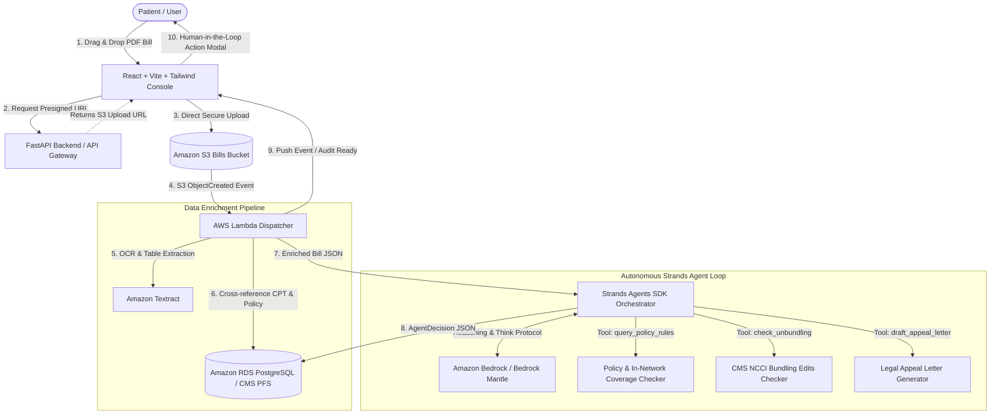

# MedAudit PRO
> **Autonomous Medical Bill Auditing Engine** · AWS Agents for Humans Hackathon (Everyday Agents Track)

[](https://opensource.org/licenses/MIT)
[](https://strandsagents.com)
[](https://aws.amazon.com/bedrock/)
[](https://aws.amazon.com)
[](https://medaudit-frontend-seven.vercel.app)

---

## 🚀 Live Demo & Video Submission

- **Demo & Pitch Video:** [Watch on YouTube (3:40)](https://youtu.be/BkWUD6-_U1o)
- **Live Web Console:** [https://medaudit-frontend-seven.vercel.app](https://medaudit-frontend-seven.vercel.app)  
  *(Mock authentication is enabled by default: judges can test uploading and reviewing sample medical bills immediately with zero login friction).*
- **Track:** **Everyday Agents**

[](https://youtu.be/BkWUD6-_U1o)

---

## 💡 Pitch & Problem Statement

### 1. The Problem We Are Solving
Over **80% of hospital and clinical bills in the United States contain billing discrepancies, unbundled procedural panels, or upcoded fees**. Ordinary patients receive confusing, multi-thousand-dollar invoices with cryptic CPT codes and zero transparency, often feeling pressured into medical debt simply because they lack professional medical billing expertise.

### 2. Who It Is For
MedAudit PRO is built for **everyday patients, families, and patient advocates** who deal with unexpected out-of-pocket medical bills and Explanation of Benefits (EOB) statements.

### 3. Why It Matters
MedAudit PRO provides everyday individuals with the clinical precision and legal leverage of an expert medical auditor. It operates autonomously in the background to:
- Cross-reference billed CPT codes against official **CMS Medicare Physician Fee Schedules (PFS)**.
- Flag abusive upcoding (e.g. billing routine visits as emergency level-5 complexity `99285`).
- Detect procedural unbundling via CMS **National Correct Coding Initiative (NCCI)** rules.
- Draft formal, legally grounded dispute appeal letters citing the **No Surprises Act** (Public Health Service Act § 2799A-1) and the **False Claims Act** (31 U.S.C. §§ 3729–3733).

---

## 🏗️ System Architecture & Strands Agents Tool Loop



### The Strands Agents Implementation
The core cognitive engine is built with the **Strands Agents SDK (Python)** inside [`agent/`](agent) utilizing:
1. **Auditor System Persona**: Strict anti-hallucination guardrails and clinical coding protocols.
2. **Deterministic `@tool` Functions**:
   - `query_policy_rules`: Verifies patient coinsurance rates, deductible status, and pre-authorization requirements.
   - `check_unbundling`: Cross-examines billed CPT codes against CMS NCCI panel guidelines to detect unbundled laboratory or procedural sets.
   - `draft_appeal_letter`: Generates formal Markdown dispute notices incorporating statutory citations under federal law.
3. **Dual Bedrock Model Execution**:
   - **Mode A (Amazon Bedrock Mantle Proxy)**: High-speed proxy directed at authorized model endpoints (`openai.gpt-oss-120b`).
   - **Mode B (Native AWS Bedrock Runtime)**: Direct Boto3 invocation of Anthropic Claude / Bedrock foundation models.
   - **Mode C (Heuristic Fallback Gate)**: Deterministic fallback protecting patient audits against network timeouts.

---

## 📂 Repository Organization & Git Submodules

MedAudit PRO is structured as an enterprise-grade monorepo containing three modular services connected via Git submodules:

```
medaudit-pro/
├── README.md                      # Master hackathon documentation (this file)
├── LICENSE                        # MIT Open Source License
├── .gitmodules                    # Submodule mapping for all tiers
├── docker-compose.yml             # Single-command local orchestration
│
├── agent/                         # [Submodule] Strands Agents SDK Core Engine
│   ├── agent/orchestrator.py      # Primary Strands Agent reasoning loop
│   ├── agent/tools/               # @tool policy_checker, unbundling_checker, letter_drafter
│   ├── agent/schemas/             # InputBill & AgentDecision Pydantic models
│   ├── agent/evaluation/          # Automated benchmark suite (eval_accuracy.py)
│   ├── requirements.txt           # strands-agents==1.54.0, boto3, openai
│   └── Dockerfile.lambda          # AWS Lambda container packaging
│
├── backend/                       # [Submodule] FastAPI REST API & Data Ingestion
│   ├── app/api/v1/                # Documents, Claims, and Dispute endpoints
│   ├── app/services/              # Textract OCR, S3 presigned URLs, Bedrock client
│   ├── app/db/                    # PostgreSQL models (CPT fee schedules, policy rules)
│   └── alembic/                   # Database migrations & seeds
│
├── frontend/                      # [Submodule] React Patient Audit Console
│   ├── src/components/medaudit/   # 3D Ingestion Dropzone, Dispute Desk Modal
│   ├── src/lib/api.ts             # Direct API integration with auto-mock auth
│   └── package.json               # React, TypeScript, Vite, TailwindCSS
│
└── infrastructure/                # CloudFormation & SAM Serverless Templates
    ├── medaudit-serverless.yaml   # API Gateway, Lambda, S3, IAM roles
    └── medaudit-prerequisites.yaml# S3 buckets and RDS VPC configuration
```

### Submodule Links:
- 🧠 **Agent Engine:** [https://github.com/sohail-kustagi/medaudit-LLM](https://github.com/sohail-kustagi/medaudit-LLM)
- ⚙️ **Backend API:** [https://github.com/sohail-kustagi/medaudit-backend](https://github.com/sohail-kustagi/medaudit-backend)
- 🖥️ **Frontend Console:** [https://github.com/stackswift/medaudit-frontend](https://github.com/stackswift/medaudit-frontend)

---

## 🛠️ Quickstart (Running Locally)

### 1. Clone with All Submodules
Clone the complete MedAudit PRO codebase in a single command:
```bash
git clone --recurse-submodules https://github.com/sohail-kustagi/medaudit-pro.git
cd medaudit-pro
```

*(If you already cloned without `--recurse-submodules`, run `git submodule update --init --recursive`).*

### 2. Run the Strands Agent Accuracy Benchmark
Verify the Strands Agent and diagnostic tools against canonical medical bill test cases:
```bash
cd agent
python3 -m venv .venv && source .venv/bin/activate
pip install -r requirements.txt
python -m agent.evaluation.eval_accuracy
```
*Expected output: `Results: 3 / 3 passed (100%)`.*

### 3. Run Backend & Frontend Locally
```bash
# Terminal 1 — Backend API
cd backend
python3 -m venv .venv && source .venv/bin/activate
pip install -r requirements.txt
uvicorn backend.app.main:app --host 0.0.0.0 --port 8000 --reload

# Terminal 2 — Frontend Console
cd frontend
npm install
npm run dev
```
Open [http://localhost:5173](http://localhost:5173) to view the MedAudit console.

---

## ⚖️ License
This project is licensed under the **MIT License** - see the [LICENSE](LICENSE) file for details.
