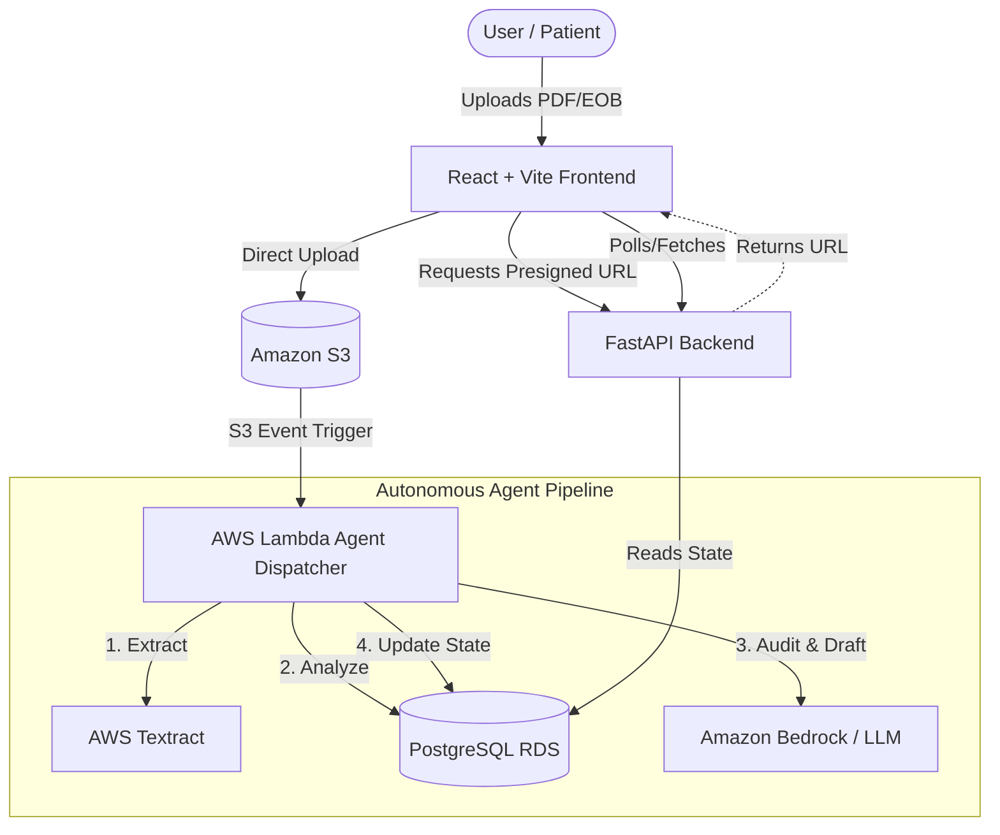

# MedAudit PRO
> Autonomous Medical Bill Auditing Engine · AWS Agents for Humans Hackathon

**MedAudit PRO** is an autonomous background agent that ingests medical bills, cross-references CPT codes against official Medicare fee schedules, detects upcoding and unbundling errors, and automatically prepares regulatory dispute letters on behalf of patients. 

## 🚀 Live Demo & Project Repositories

Because MedAudit PRO is built using a modern microservice architecture, the source code is split across three dedicated repositories. **All code, assets, and setup instructions are open source under the MIT License.**

### 1. 🖥️ [Frontend Repository](https://github.com/stackswift/medaudit-frontend)
- **Live Demo:** [https://medaudit-frontend-seven.vercel.app](https://medaudit-frontend-seven.vercel.app)
- **Stack:** React, TypeScript, Vite, TailwindCSS
- **Description:** The user-facing dashboard where patients drag-and-drop bills, view real-time audit processing status, and authorize the dispatch of dispute letters.

### 2. ⚙️ [Backend API Repository](https://github.com/sohail-kustagi/medaudit-backend)
- **Stack:** FastAPI, Python, PostgreSQL, SQLAlchemy
- **Description:** The core REST API and database orchestration layer. Handles secure presigned S3 uploads, Cognito authentication, and manages the state of the claims.

### 3. 🧠 [LLM Agent Repository](https://github.com/sohail-kustagi/medaudit-LLM)
- **Stack:** AWS Lambda, Amazon Textract, Amazon Bedrock
- **Description:** The event-driven serverless pipeline. Triggered via S3 uploads, this layer handles PDF OCR via Textract, cross-references CPT codes against CMS rules using an LLM, and calculates overcharges.

---

## 🏗️ System Architecture

---

## 🛠️ Global Setup Instructions

If you wish to run the entire MedAudit PRO stack locally, you will need to clone and run the services concurrently. Detailed setup instructions for each service can be found in their respective repository `README.md` files.

### Quick Start Overview
1. **Clone the Backend:** Configure your `.env` with AWS credentials and your PostgreSQL connection string. Run database migrations using Alembic, then start the FastAPI server on port 8000.
2. **Clone the LLM Agent:** Ensure your AWS IAM role has permissions for `textract:AnalyzeDocument` and `bedrock:InvokeModel`. Deploy the Lambda functions.
3. **Clone the Frontend:** Run `npm install` and `npm run dev`. The dashboard will be available at `localhost:5173`.

---

## 📄 License
This project is licensed under the MIT License - see the [LICENSE](LICENSE) file for details.
